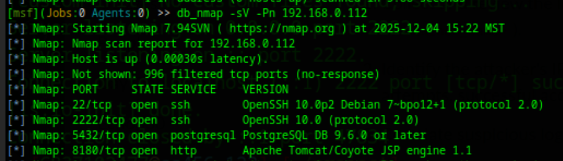

Penetration Test Report: \[Andrew (192.168.0.112)\]  
Author: \[Justin Marlor\]  
Date of Assessment: \[12/04/2025\]  
Version: 1.0

# **Executive Summary**
The purpose of this project was to better understand red team dynamics 
## **Overview**

A penetration test was conducted against the target virtual machine to identify and assess security vulnerabilities within its containerized services. Through this assessment, vulnerabilities were discovered that led to the system being compromised. Documentation was collected of the penentration testing methods taken to gain access to the system and sensitive information.

### **High-Level Test Outcomes**

The penetration test was successful. During reconnaissance, sensitive user information was discovered, and administrative privileges were obtained on the web server. With this level of access, an attacker could potentially deploy a malicious WAR file or execute arbitrary commands, leading to full system compromise and possible access to the wider network.

### **Overall Risk Rating: CRITICAL**
  
The presence of an outdate web service in the system allows for many different possible exploitation attacks, which could lead to the entire network being compromised.

### **Prioritized Recommendations** {#prioritized-recommendations}

1. Immediately remove or update the vulnerable Apache Tomcat service, which allows attackers to gain admin level access by the leveraging of hardcoded credentials(CVE-2010-0557). 

# **Test Scope and Methodology** {#test-scope-and-methodology}

## **Scope** {#scope}

The scope of this penetration test was limited to the virtual machine and its services located at the following IP address:

* **In-Scope Target:** 192.168.1.112  
* **Out-of-Scope:** Any other devices on the network were explicitly out of scope. No denial-of-service (DoS) attacks were performed.

## **Methodology** {#methodology}

The assessment followed a standard penetration testing methodology. First, reconnaissance was performed using Nmap to identify open ports and running services. Next, vulnerabilities were identified in those services using automated scanners and manual analysis. Finally, the identified vulnerabilities were exploited to demonstrate impact.

# **Detailed Findings** {#detailed-findings}

The target IP was scanned from the msfconsole using the flags -sV and -Pn. These flags allowed us to send an aggressive scan that would bypass the firewall and discover open ports, as well as the services running on them. This scan collected extremely valuable knowledge about the host machine. From this scan I discovered three services running on open ports. The SSH and Postgresql services were running up to date versions, while the http service was running an outdated version with many known exploits.

**3.1. Finding 1: Default credentials**

* **Risk Rating:** Critical  
* **Description:** The containerized FTP service is running vsftpd version 2.3.4, which contains a known backdoor. By sending a specific string as the username during login, an attacker can trigger the backdoor and open a command shell on TCP port 6200 with root privileges.  
* **Affected Services/IPs:** 192.168.1.105 (TCP Port 21\)  
* Evidence (Proof of Concept): The following screenshot shows a successful connection to the backdoor shell using netcat and the execution of the id command, confirming root-level access:  
  \[Screenshot of terminal showing: nc 192.168.1.105 6200; id; uid=0(root) gid=0(root) groups=0(root)\]  
* **Remediation Steps:** The container image for the FTP service must be updated to a version of vsftpd that is not vulnerable (any version after 2.3.4). It is recommended to pull the latest official image for the service and redeploy the container.

# **Failed Exploit Attempts** {#failed-exploit-attempts}

### **MSF exploits for Tomcat**

**4.1. Attempt 1 reverse TCP shell launch through mgr_deploy**

* **Service Targeted:** Apache Tomcat web application on Port 8180
* **Description of Attempt:** This module deploys a WAR file to the Tomcat Manager through the text-based deployment API, allowing an attacker access to a terminal. 
* **Reason for Failure:** incorrect filepath for payload. 

**4.2. Attempt 2 reverse TCP shell launch through jsp upload**

* **Service Targeted:** Apache Tomcat web application on Port 8180 
* **Description of Attempt:** This exploit uploads a single malicious JSP file that will give access to a terminal through the webpage.
* **Reason for Failure:** 

**4.2. Attempt 3 reverse TCP shell launch through jsp upload**

* **Service Targeted:** Apache Tomcat web application on Port 8180 
* **Description of Attempt:** This module uses tomcats webpage functionality to upload a WAR containing a webshell or meterpreter payload.
* **Reason for Failure:** 

# **Conclusions** {#conclusions}

## **Summary of Attack Path** {#summary-of-attack-path}

An attacker would first scan the target to discover the open FTP port. Upon identifying the vulnerable vsftpd version, they would exploit the backdoor to gain a root shell within the FTP container. From there, they could use this initial foothold to scan the internal container network, pivot to other services, and attempt to break out of the container to compromise the host VM.

## **Overall Security Posture** {#overall-security-posture}

The overall security posture of the virtual machine is very poor. The presence of a critical, well-known backdoor indicates a severe lack of basic security hygiene and patch management for the containerized services. This makes the system an easy target for even an unskilled attacker.

# **Appendix** {#appendix}

## **Tools Used** {#tools-used}

* Nmap  
* Metasploit Framework
