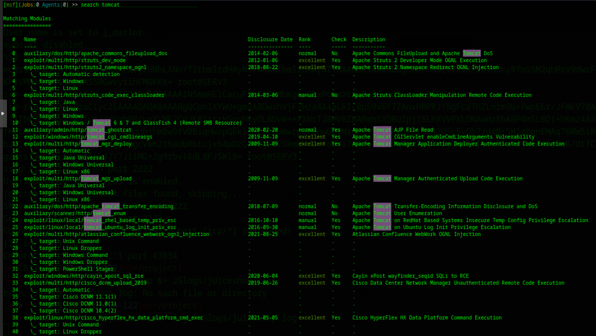

Penetration Test Report: \[Andrew (192.168.0.112)\]  
Author: \[Justin Marlor\]  
Date of Assessment: \[12/04/2025\]  
Version: 1.0

# **Executive Summary**
The purpose of this project was to better understand red team dynamics 
## **Overview**

A penetration test was conducted against the target virtual machine to identify and assess security vulnerabilities within its containerized services. Through this assessment, vulnerabilities were discovered that led to the system being compromised. No harm was done but documentation was collected of the penentration testing methods taken to gain access to the system and valuable information.

### **NMAP Scanning**

The target IP was scanned from the msfconsole using the flags -sV and -Pn. These flags allowed us to send an aggressive scan that would bypass the firewall and discover open ports, as well as the services running on them. This scan collected extremely valuable knowledge about the host network. The key takeaways from this scan being that the SSH and Postgresql services were running up to date versions, while the http service was running an outdated version with many known exploits.

### **Overall Risk Rating: CRITICAL**
  
The presence of this outdated service in the system allows for many different exploitations, compromising the entire network. 

### **MSF exploits**

### **Prioritized Recommendations** {#prioritized-recommendations}

1. Immediately update or replace the vulnerable FTP service container (CVE-2011-2523).  
2. Remediate the SQL Injection vulnerability in the web application to prevent database compromise.  
3. Enforce a strong password policy for the SSH service to protect against brute-force attacks.

# **Test Scope and Methodology** {#test-scope-and-methodology}

## **Scope** {#scope}

The scope of this penetration test was limited to the virtual machine and its services located at the following IP address:

* **In-Scope Target:** 192.168.1.112  
* **Out-of-Scope:** Any other devices on the network were explicitly out of scope. No denial-of-service (DoS) attacks were performed.

## **Methodology** {#methodology}

The assessment followed a standard penetration testing methodology. First, reconnaissance was performed using Nmap to identify open ports and running services. Next, vulnerabilities were identified in those services using automated scanners and manual analysis. Finally, the identified vulnerabilities were exploited to demonstrate impact.

# **Detailed Findings** {#detailed-findings}

**3.1. Finding 1: Remote Code Execution via Backdoored FTP Service**

* **Risk Rating:** Critical  
* **Description:** The containerized FTP service is running vsftpd version 2.3.4, which contains a known backdoor. By sending a specific string as the username during login, an attacker can trigger the backdoor and open a command shell on TCP port 6200 with root privileges.  
* **Affected Services/IPs:** 192.168.1.105 (TCP Port 21\)  
* Evidence (Proof of Concept): The following screenshot shows a successful connection to the backdoor shell using netcat and the execution of the id command, confirming root-level access:  
  \[Screenshot of terminal showing: nc 192.168.1.105 6200; id; uid=0(root) gid=0(root) groups=0(root)\]  
* **Remediation Steps:** The container image for the FTP service must be updated to a version of vsftpd that is not vulnerable (any version after 2.3.4). It is recommended to pull the latest official image for the service and redeploy the container.

**(Copy the template above for your next finding)**  
**3.2. Finding 2:** **(Copy the template above for your next finding)**  
**3.3. Finding 3:**

# **Failed Exploit Attempts** {#failed-exploit-attempts}

If you could not find and exploit a vulnerability detail the attempts here  
**4.1. Attempt 1: SSH Brute-Force Attack**

* **Service Targeted:** SSH on TCP Port 22  
* **Description of Attempt:** An automated brute-force attack was initiated against the SSH service using the hydra tool and the rockyou.txt common password list. The attack targeted common usernames such as root, admin, and user.  
* **Reason for Failure:** The attack did not result in any successful logins after running for a significant duration. This suggests that the accounts either have strong, non-dictionary passwords or that security measures like fail2ban may be in place, though no active blocking was observed. The attack was stopped to avoid potential account lockouts.

**4.2. Attempt 2: Unsuccessful Shell via SQL Injection**

* **Service Targeted:** Web Application on TCP Port 80  
* **Description of Attempt:** A SQL injection vulnerability was identified on the web application's login page. Using sqlmap, it was possible to bypass authentication and enumerate database names. An attempt was then made to leverage this vulnerability to gain an operating system shell on the container using the \--os-shell command in sqlmap.  
* **Reason for Failure:** While database access was successful, the attempt to escalate to an OS shell failed. This is likely due to restrictive file permissions for the database user (www-data), preventing it from writing a web shell to the necessary directories. The exploit path through the backdoored FTP service was deemed more efficient.

# **Conclusions** {#conclusions}

## **Summary of Attack Path** {#summary-of-attack-path}

An attacker would first scan the target to discover the open FTP port. Upon identifying the vulnerable vsftpd version, they would exploit the backdoor to gain a root shell within the FTP container. From there, they could use this initial foothold to scan the internal container network, pivot to other services, and attempt to break out of the container to compromise the host VM.

## **Overall Security Posture** {#overall-security-posture}

The overall security posture of the virtual machine is very poor. The presence of a critical, well-known backdoor indicates a severe lack of basic security hygiene and patch management for the containerized services. This makes the system an easy target for even an unskilled attacker.

# **Appendix** {#appendix}

## **Tools Used** {#tools-used}

* Nmap  
* Metasploit Framework